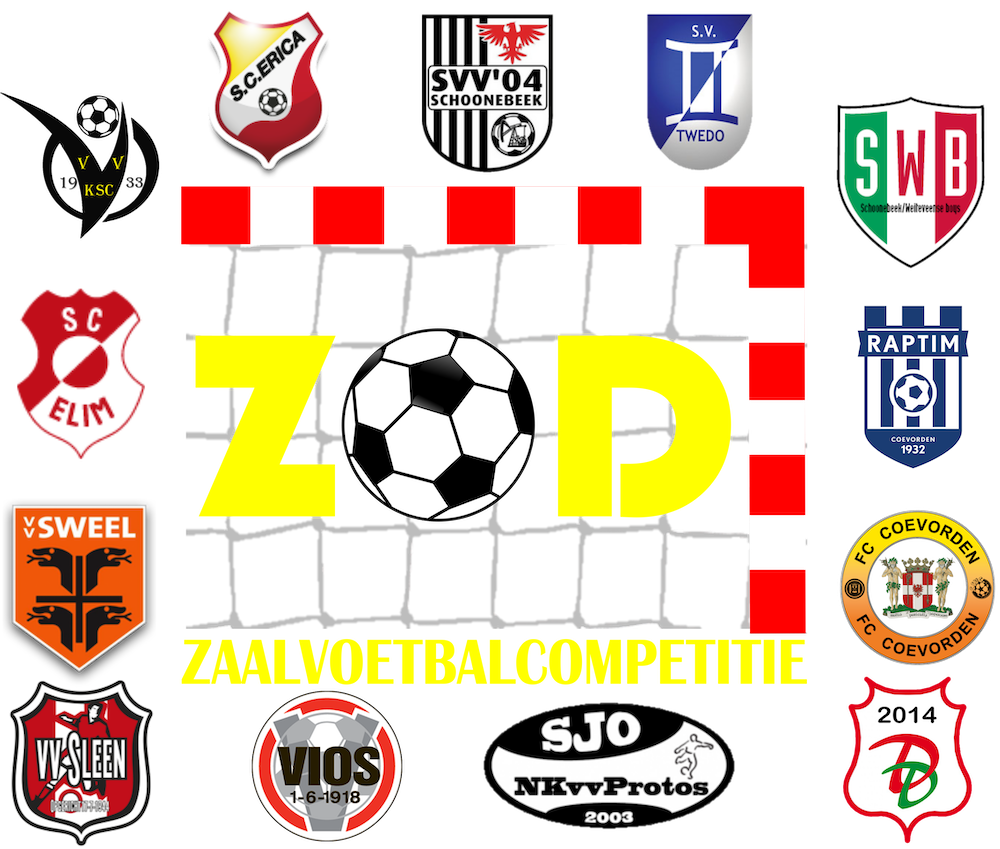

# Zuid-Oost Drenthe Zaalvoetbal

https://zodzaalvoetbal.nl

This is a website for a local soccer competition for youth players in Zuid-Oost Drenthe, The Netherlands.

The site is build around Gatsby, and has the following features:

-   Import all teams, games and poules from a Google Spreadsheet and outputs them to JSON files
-   Gatsby site which uses the `gatsby-transformer-json` plugin to read in the data
-   Show overview of all clubs, teams, poules, games, etc.
-   Generate game result sheets for each location in PDF based on puppeteer.

# Importing

-   `cd ./import`
-   Create a `.env` file containing `SHEET_SHARE_LINK=<shared-google-spreadsheet-link>`
-   `npm run import`

# Website

-   `cd ./app`
-   `npm run start` -> Run the site in development mode
-   `npm run build` -> Build the site
-   `npm run pdf` -> Create all the downloadable pdf files
-   `npm run release` -> Build + pdf
-   `npm run deploy` -> Deploy with FTP
